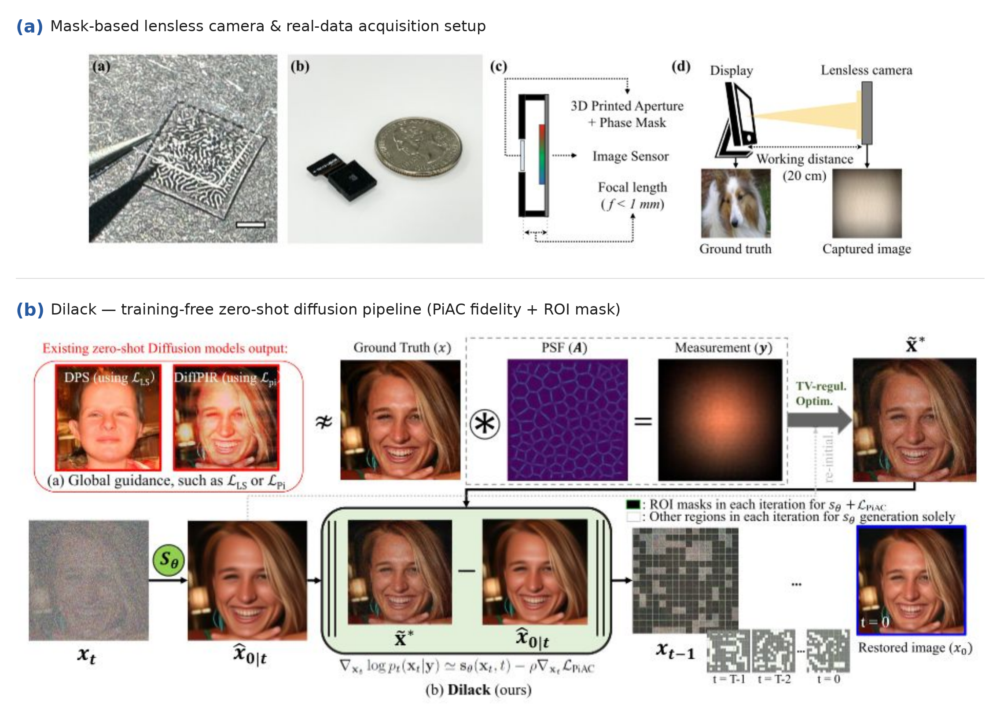
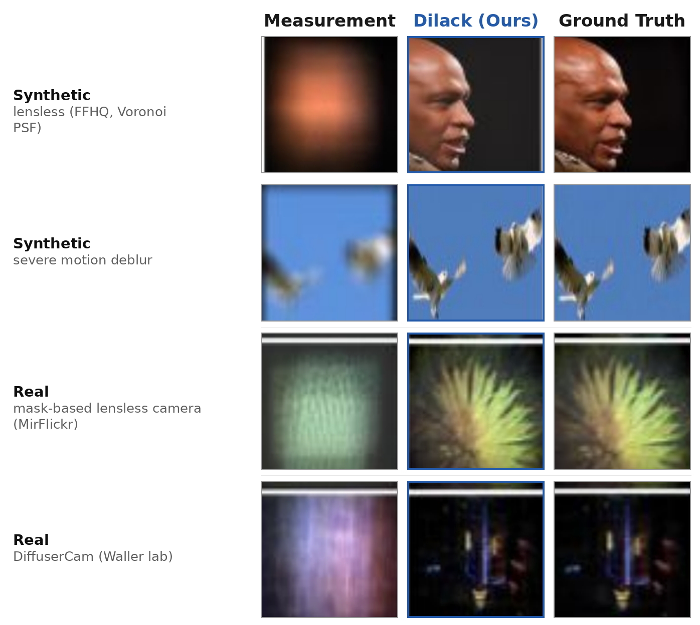

<div align="center">

# Dilack: Fidelity-preserving Zero-shot Diffusion Models for Highly Ill-posed Inverse Problems in Lensless Imaging

**Haechang Lee**<sup>a,\*</sup> · **Dong Ju Mun**<sup>a,\*</sup> · **Hyunwoo Lee**<sup>a,\*</sup> · **Kyung Chul Lee**<sup>b,d</sup> · **Seongmin Hong**<sup>a</sup> · **Gwanghyun Kim**<sup>a</sup> · **Seung Ah Lee**<sup>b,†</sup> · **Se Young Chun**<sup>a,c,†</sup>

<sup>a</sup>Dept. of ECE &nbsp;·&nbsp; <sup>b</sup>Dept. of ME &nbsp;·&nbsp; <sup>c</sup>IPAI &amp; INMC &nbsp;·&nbsp; <sup>d</sup>School of MAE, IAMD<br>
Seoul National University, Republic of Korea<br>
<sup>\*</sup>Equal contribution &nbsp;·&nbsp; <sup>†</sup>Corresponding authors (`seungahlee@snu.ac.kr`, `sychun@snu.ac.kr`)

[](https://doi.org/10.1016/j.imavis.2025.105786)
[](https://github.com/mundongju/Dilack)
[](LICENSE)

</div>

---

<div align="center">


<em><b>Dilack</b> is a training-free, zero-shot diffusion solver for raw image restoration from mask-based lensless cameras, replacing unstable least-squares fidelity with a <b>pseudo-inverse anchor (PiAC)</b> and an <b>ROI-masked</b> guidance.</em>
</div>

---

## Results

<div align="center">

</div>

Across synthetic (lensless / severe motion deblur) and real (MirFlickr-lensless, DiffuserCam) measurements, Dilack recovers structure and fine detail where existing zero-shot diffusion methods collapse. Full quantitative tables are in the [paper](https://doi.org/10.1016/j.imavis.2025.105786).

---

## Code Structure

```
Dilack/
├── sample_condition.py          # ⭐ unified entry point for every task
├── run_dilack.sh                # one reference command per task
├── check_result_integrated.py   # aggregate PSNR / SSIM / FID / LPIPS over a result folder
├── ADMM_Torch_color*.py         # ADMM-TV pseudo-inverse anchor (synthetic / real / Waller)
├── configs/
│   ├── diffusion_config.yaml    # DDPM sampler settings (shared)
│   ├── model/                   # imagenet256 / ffhq UNet configs
│   ├── synthetic/               # Voronoi / Turing / motion-deblur tasks
│   ├── real/                    # ys_flickr / diffusercam tasks
│   └── baselines/               # vanilla DPS (ps_conv) configs
├── guided_diffusion/            # UNet, DDPM sampler, measurements, PiAC conditioning
├── data/dataloader.py           # FFHQ / ImageNet / real lensless datasets
├── motionblur/                  # motion-blur kernel generator
└── util/                        # image utils, metrics, logger
```

The task is selected entirely by the task config (`measurement.operator.name`); a single `sample_condition.py` reproduces every experiment.

| Group | Task | `operator.name` | Data | Config |
|-------|------|-----------------|------|--------|
| Synthetic | Lensless — **Voronoi** PSF | `lensless_voronoi` | ImageNet / FFHQ | `configs/synthetic/lensless_voronoi_{imagenet,ffhq}.yaml` |
| Synthetic | Lensless — **Turing** PSF | `lensless_turing` | ImageNet / FFHQ | `configs/synthetic/lensless_turing_{imagenet,ffhq}.yaml` |
| Synthetic | **Severe motion deblur** | `motion_blur` | ImageNet / FFHQ | `configs/synthetic/motion_deblur_{imagenet,ffhq}.yaml` |
| Real | **Mask-based lensless** (MirFlickr) | `lensless_real_ys` | MirFlickr captures (100) | `configs/real/ys_flickr.yaml` |
| Real | **Waller DiffuserCam** | `lensless_real_waller` | DiffuserCam DLMD (100) | `configs/real/diffusercam.yaml` |

The vanilla **DPS** baselines (`ps_conv`) are under `configs/baselines/`.

---

## Setup

```bash
git clone https://github.com/mundongju/Dilack
cd Dilack
conda create -n dilack python=3.8 -y
conda activate dilack
pip install -r requirements.txt
# install a CUDA build of torch/torchvision for your system, e.g.:
# pip install torch torchvision --index-url https://download.pytorch.org/whl/cu118
```

Requires a CUDA-capable GPU (experiments were run on an RTX 3090).

---

## Pretrained checkpoints

Dilack is **zero-shot**: it reuses off-the-shelf unconditional diffusion priors, identical to [DPS](https://github.com/DPS2022/diffusion-posterior-sampling).

| Model | File | Source |
|-------|------|--------|
| ImageNet 256×256 (uncond.) | `models/imagenet256.pt` | [guided-diffusion](https://github.com/openai/guided-diffusion) `256x256_diffusion_uncond.pt` |
| FFHQ 256×256 | `models/ffhq_10m.pt` | [DPS Google Drive](https://drive.google.com/drive/folders/1jElnRoFv7b31fG0v6pTSQkelbSX3xGZh?usp=sharing) |

```bash
mkdir -p models
# ImageNet 256x256 unconditional
wget -O models/imagenet256.pt \
  https://openaipublic.blob.core.windows.net/diffusion/jul-2021/256x256_diffusion_uncond.pt
# FFHQ: download ffhq_10m.pt from the DPS Google Drive and move it to ./models/
```

---

## Datasets

**Synthetic (ImageNet / FFHQ).** ~1,000 validation images per dataset at 256×256, following the DPS protocol. The synthetic Voronoi / Turing PSFs are shipped with the repo. Download `lensless_data.zip`,mkdir `samples/lensless_data/` and unzip it into `samples/lensless_data/`:

> 📦 **Download:** `lensless_data.zip` — [Google Drive](https://drive.google.com/file/d/1NA8vLNTacP3j_9qW1u2fI6xB-bonoTIf/view?usp=sharing)

```
samples/dps_val/imagenet/   *.JPEG
samples/dps_val/ffhq/        *.png
samples/lensless_data/ys_v4/psf_voronoi.png
samples/lensless_data/ys_v2_dj_turing/psf/psf_turing.png
```


**Real 1 — mask-based lensless camera (MirFlickr).** 100 [MirFlickr](https://press.liacs.nl/mirflickr/) images displayed on a monitor and captured through our custom Voronoi-PSF lensless system (working distance ≈ 20 cm). Download `ys_flicker_100.zip`,mkdir `samples/dps_val/` and unzip it into `samples/dps_val/ys_flickr_100/`:

> 📦 **Download:** `ys_flicker_100.zip` — [Google Drive](https://drive.google.com/file/d/1d2R4I-tP2rL4Ndqx67eBYPoeoaOra8uK/view?usp=sharing)

```
samples/dps_val/ys_flickr_100/
├── raw/      im*.tiff   # lensless measurements (100)
├── label/    im*.jpg    # ground-truth (100)
└── psf/      psf_camera1_original.tiff
```

**Real 2 — Waller-lab DiffuserCam.** 100 samples (indices 10000–10099) of the public DiffuserCam Lensless MirFlickr Dataset (DLMD). Dataset & PSF: <https://waller-lab.github.io/LenslessLearning/dataset.html>.

```
samples/dps_val/diffusercam_100/
├── LQ/      *.png       # diffuser measurements (100)
├── GT/      *.png       # ground-truth lensed images (100)
└── psf.tiff             # DiffuserCam calibration PSF
```

---

## Running

A reference command for every task is collected in [`run_dilack.sh`](run_dilack.sh):

```bash
bash run_dilack.sh
```

General invocation (swap the task config / model config to change the task; use the `_ffhq.yaml` task config + `configs/model/ffhq_model_config.yaml` for faces):

```bash
python sample_condition.py \
    --model_config     configs/model/imagenet256_model_config.yaml \
    --diffusion_config configs/diffusion_config.yaml \
    --task_config      configs/synthetic/lensless_voronoi_imagenet.yaml \
    --deconv_type admm --crop 450 --noise 1 --wiener_alpha 0 \
    --gpu 0 --save_dir ./results
```

Real tasks turn off synthetic noise (`--noise 0`); the Waller DiffuserCam is native 256, so it uses `--crop 0 --wiener_alpha 0.001`.

### Key arguments

| Argument | Meaning |
|----------|---------|
| `--deconv_type` | guidance anchor: `admm` (Dilack default), `deconv` (Wiener only), `noise` (no anchor) |
| `--crop` | central measurement crop for synthetic lensless (`450`); `0` for Waller |
| `--noise` | add sensor Gaussian noise to the synthetic measurement (`1` synthetic, `0` real) |
| `--wiener_alpha` | regularization of the Wiener pseudo-inverse anchor |
| `--admm_only` | only compute the classical anchor, skip diffusion sampling |
| `--skip_processed` | resume by skipping images already written to `recon/` |
| `--gpu`, `--save_dir` | device id / output directory |

Each run writes `results/<operator>/<data>/<method>/` with `label/`, `input/`, `wiener/`, `admm/`, `recon/`, `progress/` and per-image `PSNR,SSIM,FID,LPIPS` text files.

---

## Evaluation

Aggregate the metrics of a reconstruction folder against the ground-truth:

```bash
python check_result_integrated.py \
    results/<operator>/<data>/<method>/label \
    results/<operator>/<data>/<method>/recon
```

---

## Citation

```bibtex
@article{lee2025dilack,
  title     = {Fidelity-preserving zero-shot diffusion models for highly ill-posed inverse problems in lensless imaging},
  author    = {Lee, Haechang and Mun, Dong Ju and Lee, Hyunwoo and Lee, Kyung Chul and Hong, Seongmin and Kim, Gwanghyun and Lee, Seung Ah and Chun, Se Young},
  journal   = {Image and Vision Computing},
  publisher = {Elsevier},
  year      = {2025},
  doi       = {10.1016/j.imavis.2025.105786},
  note      = {Article 105786}
}
```

---

## Acknowledgements

This codebase builds upon [DPS](https://github.com/DPS2022/diffusion-posterior-sampling) and [guided-diffusion](https://github.com/openai/guided-diffusion) for the diffusion priors and sampler, [motionblur](https://github.com/LeviBorodenko/motionblur) for the motion kernels, and the [Waller-lab DiffuserCam](https://waller-lab.github.io/LenslessLearning/) dataset for the real lensless benchmark. We thank the authors for releasing their code and data.
